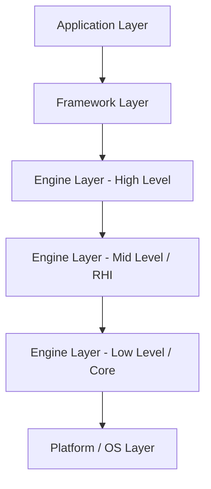

# Break Engine 架构概览

> 纯 C (C11) 跨平台 3D 渲染引擎

---

## 目录

1. [项目概述](#1-项目概述)
2. [顶层目录结构](#2-顶层目录结构)
3. [分层架构设计](#3-分层架构设计)
4. [核心模块总览](#4-核心模块总览)
5. [模块依赖关系](#5-模块依赖关系)
6. [技术栈](#6-技术栈)
7. [关键设计决策](#7-关键设计决策)
8. [外部依赖](#8-外部依赖)
9. [平台支持](#9-平台支持)
10. [后续文档索引](#10-后续文档索引)

---

## 1. 项目概述

| 项目 | 说明 |
|------|------|
| **项目名称** | Break Engine |
| **定位** | 纯 C (C11) 跨平台 3D 渲染引擎 |
| **核心目标** | 避免 C++ 隐式成本，提供高性能、可移植的渲染引擎框架 |
| **当前状态** | Phase 0-8Y 完成，188 FPS (Intel UHD TGL GT1 @1280×720)，17/17 测试通过 |

### 技术优势

- **编译速度快 2-5 倍** — 无模板展开、无 header-only 膨胀
- **ABI 稳定** — C 结构体布局明确，跨版本/跨编译器兼容
- **调试透明** — 无名称修饰（name mangling），栈帧清晰可读
- **任何语言可调用** — 天然 FFI 友好（Python/Rust/Zig/Lua 等可直接绑定）
- **内存确定性** — 显式分配/释放，无隐式拷贝、无 RAII 魔法

---

## 2. 顶层目录结构

```
break/
├── engine/           # 核心引擎（纯 C，主代码库）
│   ├── src/          #   源码实现（按模块划分子目录）
│   ├── include/      #   公共头文件
│   ├── external/     #   第三方库（单头文件）
│   ├── shaders/      #   GLSL/SPIR-V 着色器
│   ├── assets/       #   引擎内置资源
│   └── tools/        #   离线工具（packer 等）
├── framework/        # C++ 框架层（应用生命周期管理）
│   ├── interface/    #   抽象接口定义
│   └── common/       #   基础实现（BaseApplication）
├── empty/            # 最小化示例应用
├── platform/         # 平台演示代码（Windows/Linux）
│   ├── linux/        #   X11/XCB + OpenGL 示例
│   └── windows/      #   Win32 + D3D11 示例
├── docs/             # 技术文档
└── build*/           # 构建输出（build-gl, build-vk, build-asan 等）
```

### 各目录职责

| 目录 | 职责 |
|------|------|
| `engine/` | 引擎核心，纯 C11 实现，包含所有运行时子系统（渲染、物理、音频、ECS 等） |
| `framework/` | C++ 应用框架，提供模块化的生命周期管理接口（Init/Tick/DeInit） |
| `empty/` | 最小化应用骨架，演示如何接入 framework 层 |
| `platform/` | 各平台的 Hello World 级别演示程序 |
| `docs/` | 架构设计、执行计划、技术笔记等文档 |
| `build*/` | CMake 构建产物输出目录（不纳入版本控制） |

---

## 3. 分层架构设计

Break Engine 采用**严格分层、单向依赖**的架构模型：

```
┌─────────────────────────────────────────────────────────────────┐
│                     Application Layer（应用层）                   │
│         empty_application / 用户游戏逻辑 / 编辑器                │
├─────────────────────────────────────────────────────────────────┤
│                     Framework Layer（框架层）                     │
│  RuntimeModuleInterface → ApplicationInterface → BaseApplication│
├─────────────────────────────────────────────────────────────────┤
│                      Engine Layer（引擎层）                       │
│  ┌───────────────────────────────────────────────────────────┐  │
│  │  High-Level: Renderer / ECS / Asset / Animation / Physics │  │
│  ├───────────────────────────────────────────────────────────┤  │
│  │  Mid-Level:  RHI (OpenGL + Vulkan) / Task / Script / UI   │  │
│  ├───────────────────────────────────────────────────────────┤  │
│  │  Low-Level:  Core (Log/Alloc/String) / Math / Platform    │  │
│  └───────────────────────────────────────────────────────────┘  │
├─────────────────────────────────────────────────────────────────┤
│                   Platform/OS Layer（平台层）                     │
│              X11 / Win32 / Vulkan Driver / OpenGL Driver         │
└─────────────────────────────────────────────────────────────────┘
```

### 层级职责

- **Application Layer** — 最终用户代码，实现具体的游戏/应用逻辑
- **Framework Layer** — C++ 模块化框架，定义 `RuntimeModuleInterface`（Init/Tick/DeInit 三阶段），提供 `BaseApplication` 基类
- **Engine Layer** — 纯 C 引擎核心，提供所有运行时子系统
  - High-Level：面向场景的渲染管线、ECS、资源管理、动画、物理
  - Mid-Level：硬件抽象层（RHI）、并行任务、脚本、调试 UI
  - Low-Level：内存分配、日志、字符串、数学库、平台窗口/输入/时间
- **Platform/OS Layer** — 操作系统 API（X11、Win32）及 GPU 驱动

### Mermaid 层级图



---

## 4. 核心模块总览

| 模块 | 位置 | 职责 |
|------|------|------|
| **Core** | `engine/src/core/` | 基础设施：日志(log)、内存分配器(alloc)、字符串(string)、性能剖析(profiler)、类型定义(types)、断言(assert) |
| **Platform** | `engine/src/platform/` | 平台抽象：窗口管理(window_x11 / window_wayland / window_win32)、输入处理(input，含键盘/鼠标/游戏手柄)、高精度时间(time)、文件监视(filewatch，递归)、高 DPI 与多显示器查询 |
| **RHI** | `engine/src/rhi/` | 渲染硬件接口：统一的 GPU API 抽象层，后端包括 OpenGL (`rhi_gl.c`) 和 Vulkan (`rhi_vk.c`) |
| **Math** | `engine/src/math/` | 数学库：向量、矩阵、四元数、变换等 |
| **ECS** | `engine/src/ecs/` | 实体-组件-系统架构，数据驱动的对象管理 |
| **Asset** | `engine/src/asset/` | 资源管理：资产加载(asset)、热重载(hotreload)、虚拟文件系统(vfs) |
| **Renderer** | `engine/src/renderer/` | 渲染管线：相机、剔除、天空盒、地形、水体、粒子、光照、阴影、后处理全链路（SSAO/TAA/SSR/DoF/Bloom/FXAA/运动模糊/色调映射/体积光/God Rays 等） |
| **Animation** | `engine/src/animation/` | 骨骼动画系统 |
| **Physics** | `engine/src/physics/` | 物理模拟：刚体物理、角色控制器 |
| **Audio** | `engine/src/audio/` | 音频系统（基于 miniaudio） |
| **Task** | `engine/src/task/` | 多线程任务调度系统 |
| **Script** | `engine/src/script/` | 脚本系统（运行时行为驱动） |
| **UI** | `engine/src/ui/` | 调试 UI 和字体渲染 |

---

## 5. 模块依赖关系

```
                          ┌─────────┐
                          │  Game   │
                          └────┬────┘
                               │
            ┌──────────────────┼──────────────────┐
            │                  │                  │
       ┌────▼────┐      ┌─────▼─────┐     ┌─────▼─────┐
       │Renderer │      │    ECS    │     │   Asset   │
       └────┬────┘      └─────┬─────┘     └─────┬─────┘
            │                  │                  │
            │    ┌─────────────┼─────────────┐    │
            │    │             │             │    │
       ┌────▼────▼──┐   ┌─────▼─────┐  ┌───▼────▼───┐
       │    RHI     │   │ Animation │  │  Physics   │
       └────┬───────┘   └─────┬─────┘  └─────┬──────┘
            │                  │              │
            └──────────────────┼──────────────┘
                               │
                    ┌──────────▼──────────┐
                    │   Core / Math       │
                    └──────────┬──────────┘
                               │
                    ┌──────────▼──────────┐
                    │     Platform        │
                    └──────────┬──────────┘
                               │
                    ┌──────────▼──────────┐
                    │      OS / GPU       │
                    └─────────────────────┘
```

### 依赖规则

- **严格单向依赖**：上层依赖下层，禁止反向引用
- **无循环依赖**：任意模块间的依赖关系构成有向无环图 (DAG)
- **Core/Math 是最底层引擎模块**：所有模块可依赖，但 Core 不依赖任何引擎模块
- **Platform 为平台隔离层**：仅 Core 和 RHI 可直接依赖 OS API

---

## 6. 技术栈

| 类别 | 技术 |
|------|------|
| **语言** | C11（引擎核心）、C++11（框架层） |
| **构建系统** | CMake 3.20+，支持多配置（GL/VK/ASAN/Debug） |
| **图形 API** | OpenGL 4.x（主要开发）、Vulkan 1.x（高性能路径） |
| **窗口系统** | X11 / Wayland（Linux，编译时互斥）、Win32（Windows） |
| **着色器语言** | GLSL 450、SPIR-V（Vulkan 路径使用 shaderc 编译） |
| **编译器** | GCC、Clang、MSVC（/W4 /WX 级别警告） |
| **静态分析** | -Wall -Wextra -Werror -pedantic |
| **运行时检测** | AddressSanitizer（可选） |
| **第三方库** | cgltf、glad、miniaudio、stb_image、stb_truetype |

---

## 7. 关键设计决策

| 决策领域 | 方案 | 理由 |
|----------|------|------|
| **多态/虚函数** | 函数指针表（手动 vtable） | 内存布局透明、无 C++ RTTI 开销 |
| **泛型编程** | `_Generic` 宏 + `void*` | 编译期类型分发，零运行时成本 |
| **封装** | 不透明指针（opaque pointer） | 隐藏实现细节，保持 ABI 稳定 |
| **错误处理** | 返回值（bool/错误码） | 无异常表、可预测的控制流 |
| **字符串** | Slice 模式（指针 + 长度） | 避免隐式 `strlen()`，支持非拷贝子串 |
| **GPU 抽象** | RHI 层 + 双后端 | 统一接口，Vulkan-first 设计，SPIR-V 着色器 |
| **内存管理** | 自定义分配器 + Arena | 显式生命周期，避免碎片化 |
| **并行** | 任务系统（Task） | 基于线程池的细粒度并行 |
| **资源热重载** | inotify/文件监视 | 开发期免重启，即时看到修改效果 |
| **模块化** | 目录隔离 + 头文件接口 | 每个子系统独立编译，清晰边界 |

---

## 8. 外部依赖

所有第三方库位于 `engine/external/`，均为单头文件/单源文件实现：

| 库 | 文件 | 用途 | 许可证 |
|----|------|------|--------|
| **cgltf** | `cgltf.h` | glTF 2.0 模型加载（解析 .glb/.gltf） | MIT |
| **glad** | `glad.h` + `glad.c` | OpenGL 函数加载器（GL 4.x Core） | MIT / Public Domain |
| **KHR** | `khrplatform.h` | Khronos 平台类型定义（glad 依赖） | MIT |
| **miniaudio** | `miniaudio.h` | 跨平台音频播放/录制 | MIT-0 / Public Domain |
| **stb_image** | `stb_image.h` + `stb_image_impl.c` | 图像加载（PNG/JPG/BMP/TGA） | MIT / Public Domain |
| **stb_image_write** | `stb_image_write.h` | 图像写入（截图/纹理导出） | MIT / Public Domain |
| **stb_truetype** | `stb_truetype.h` | TrueType 字体光栅化 | MIT / Public Domain |

### 设计原则

- 全部为**零依赖**单文件库，无额外传递依赖
- 均选择 **宽松许可证**（MIT/Public Domain），商用友好
- 通过单独编译单元隔离（如 `stb_image_impl.c`），避免头文件实现污染

---

## 9. 平台支持

| 平台 | 窗口系统 | 图形 API | 构建配置 | 状态 |
|------|----------|----------|----------|------|
| **Linux** | X11 | OpenGL 4.x | `build-verify-x11-gl/` | ✅ 全功能支持 |
| **Linux** | X11 | Vulkan 1.x | `build-verify-x11-vk/` | ✅ 全功能支持 |
| **Linux** | Wayland | OpenGL 4.x (EGL) | `build-verify-wl-gl/` | ✅ 全功能支持 |
| **Linux** | Wayland | Vulkan 1.x | `build-verify-wl-vk/` | ✅ 全功能支持 |
| **Windows** | Win32 | OpenGL (WGL) / Vulkan (Win32 Surface) | `build-win/` | ✅ 已实现 |
| **macOS** | — | Metal | — | 📋 规划中 |
| **WebAssembly** | Canvas | WebGPU | — | 📋 规划中 |

### Linux 全功能支持说明

Linux 平台已完成全功能支持，覆盖窗口、输入、音频、文件系统等所有子系统：

- **窗口系统**：X11（Xlib）与 Wayland（XDG Shell + xkbcommon）双后端，编译时通过 `ENGINE_ENABLE_WAYLAND` 选项互斥切换；Wayland 后端通过 EGL 管理 OpenGL 上下文，并支持 Vulkan `VK_KHR_wayland_surface`。
- **输入系统**：键盘、鼠标（含侧键、捕获/隐藏/相对模式）、游戏手柄（基于 evdev，支持热插拔、摇杆/扳机归一化、最多 4 个手柄）。
- **音频设备**：基于 miniaudio 的设备枚举与选择 API（`audio_get_device_count` / `audio_set_device`）。
- **文件监视**：基于 inotify 的递归目录监视与结构化事件解析，驱动 Shader/资源热重载。
- **高 DPI / 多显示器**：`platform_get_dpi` / `platform_get_scale_factor` / `platform_get_monitor_info` 统一 API。

### 构建变体

```bash
# X11 + OpenGL 后端
cmake -B build-gl -DENGINE_VULKAN=OFF && make -C build-gl

# X11 + Vulkan 后端
cmake -B build-vk -DENGINE_VULKAN=ON && make -C build-vk

# Wayland + OpenGL 后端
cmake -B build-wl-gl -DENGINE_ENABLE_WAYLAND=ON && make -C build-wl-gl

# Wayland + Vulkan 后端
cmake -B build-wl-vk -DENGINE_ENABLE_WAYLAND=ON -DENGINE_VULKAN=ON && make -C build-wl-vk

# ASAN 检测
cmake -B build-asan -DENGINE_USE_ASAN=ON && make -C build-asan
```

---

## 10. 后续文档索引

| 文档 | 说明 |
|------|------|
| [PureC_Engine_ExecutionPlan.md](PureC_Engine_ExecutionPlan.md) | 纯 C 引擎执行计划（Phase 分阶段路线图） |
| [PureC_Engine_Proposal.md](PureC_Engine_Proposal.md) | 纯 C 引擎技术提案 |
| [PureC_Engine_DeepDive.md](PureC_Engine_DeepDive.md) | 纯 C 引擎技术深潜 |
| [Phase5B_ClusteredLighting.md](Phase5B_ClusteredLighting.md) | Clustered Lighting 技术方案 |
| [BW191_Architecture.md](BW191_Architecture.md) | BW191 架构参考 |
| [CryENGINE_Architecture.md](CryENGINE_Architecture.md) | CryENGINE 架构分析 |
| [GEFS_Architecture.md](GEFS_Architecture.md) | GEFS 架构参考 |
| [T3DGameR1_Architecture.md](T3DGameR1_Architecture.md) | T3D 游戏引擎架构参考 |

### 待创建文档

- `Engine_Modules.md` — 各引擎模块详细设计文档
- `Rendering_Pipeline.md` — 渲染管线详解（前向/延迟、后处理链路）
- `Build_Guide.md` — 构建指南（环境配置、交叉编译、CI/CD）
- `RHI_Design.md` — 渲染硬件接口抽象层设计
- `ECS_Design.md` — 实体组件系统设计

---

*文档版本: v1.1 | 最后更新: 2026-05（Linux 全功能支持）*
